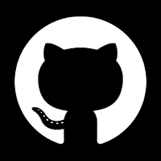
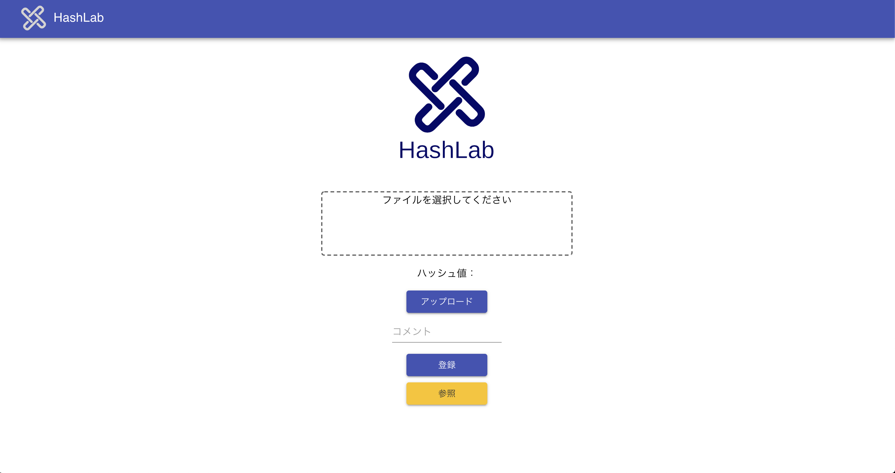
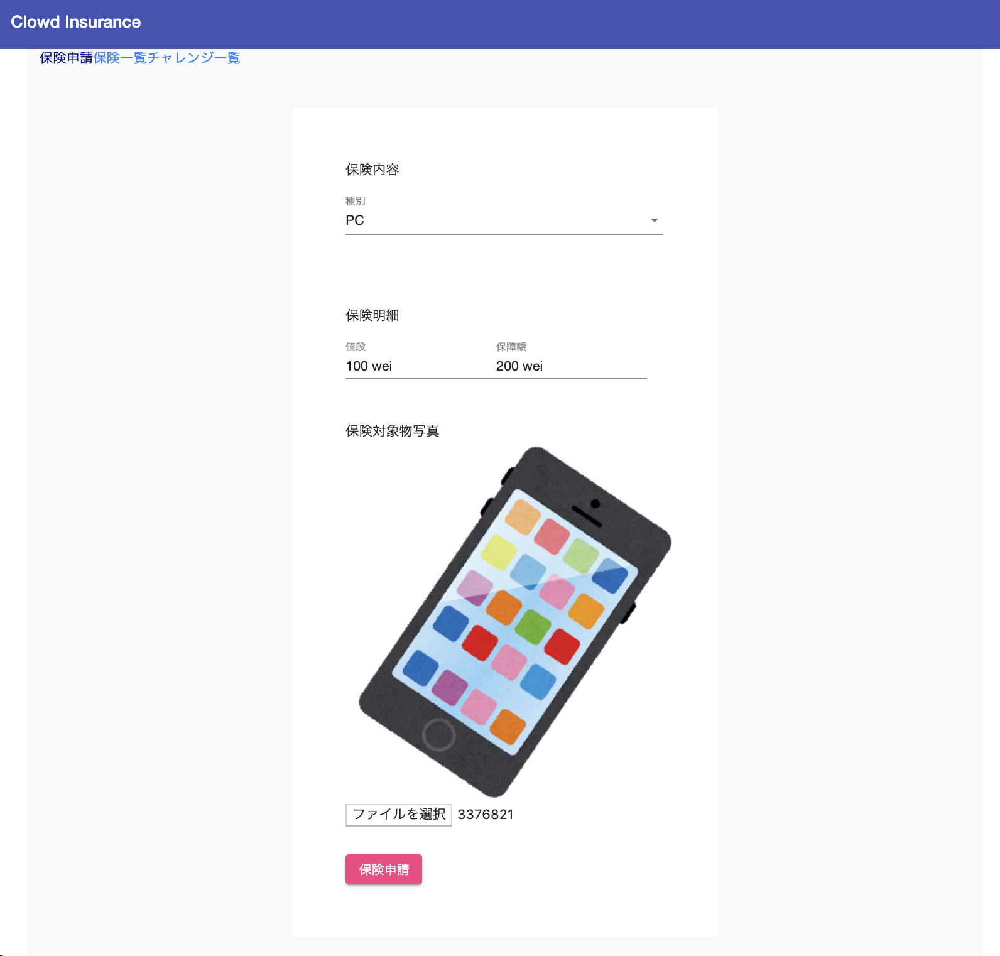
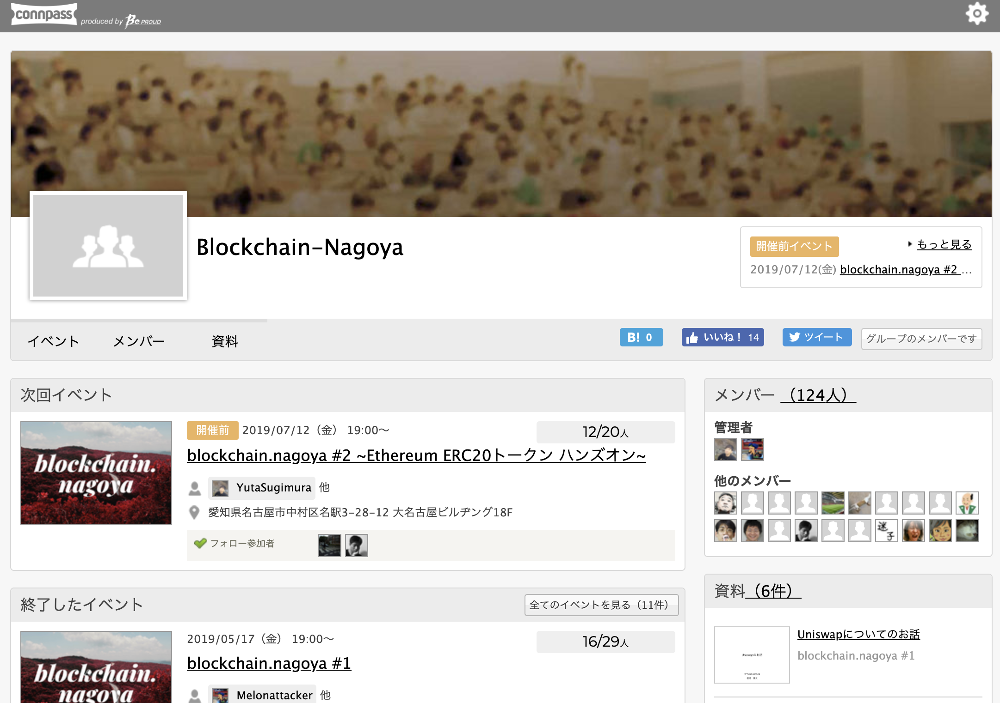
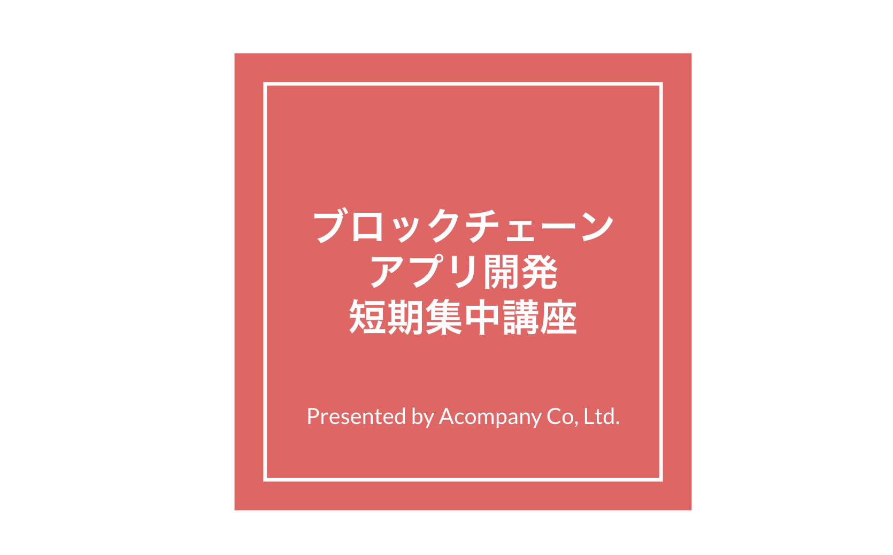
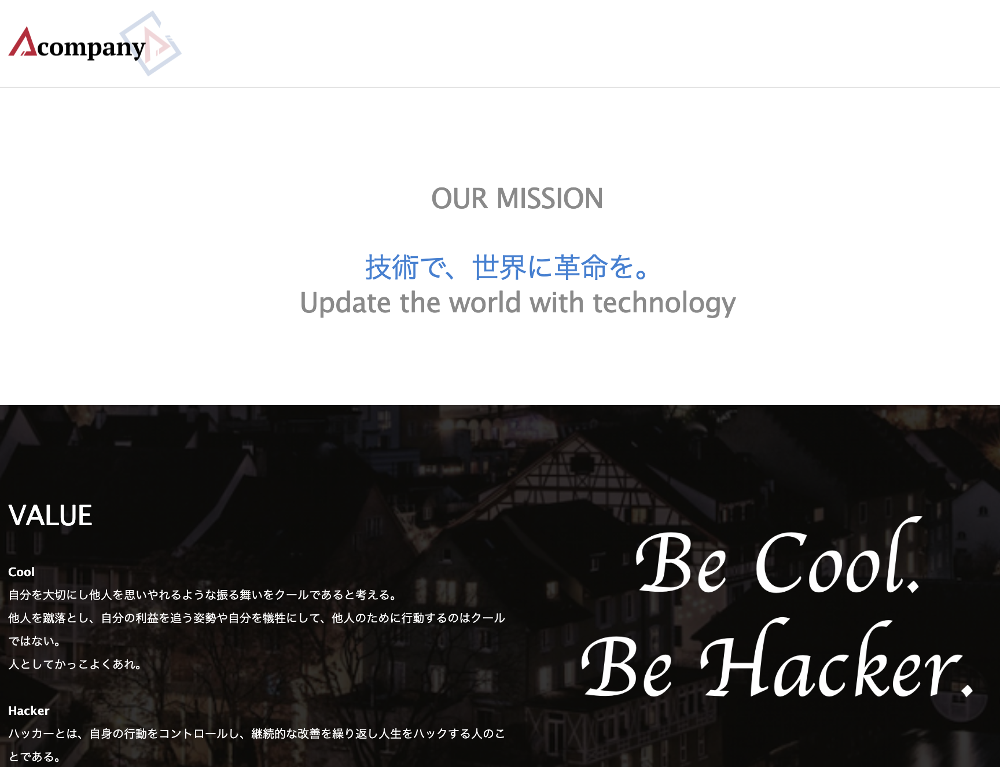

# Profile

# Products
## HashLab
[https://hashlab-144c9.firebaseapp.com/](https://hashlab-144c9.firebaseapp.com/)

This app can prove you your own performance without relying on a specific third party by providing apostille and distributed data storage.

## Clowd Insurance

[https://clowd-insurance.firebaseapp.com/
](https://clowd-insurance.firebaseapp.com/
)

This app is an insurance service using a distributed voting system.
Participant voting will determine if the smart contract will apply insurance to the insured.

# Community
## blockchain.nagoya

[https://ether-nagoya.connpass.com/](https://ether-nagoya.connpass.com/)

I regularly host blockchain study sessions in Nagoya.

## ブロックチェーンアプリ開発講座(Dapps development course)

[https://docs.google.com/presentation/d/1lHr7c4MSblhqLWWdpHYYILlVn5CcN-QmG4JCak1mYYA/edit?usp=sharing](https://docs.google.com/presentation/d/1lHr7c4MSblhqLWWdpHYYILlVn5CcN-QmG4JCak1mYYA/edit?usp=sharing)

I hold the Ethereum application development course in Nagoya.

If you want to apply this course, click under button.

<button type="button" onclick="location.href='https://forms.gle/ZuQ1ksFMuLKy76FT8'">Apply</button>

# Job
## Acompany Co., Ltd.

[https://acompany.tech/](https://acompany.tech/)

I work in the Acompany's R&D team.

