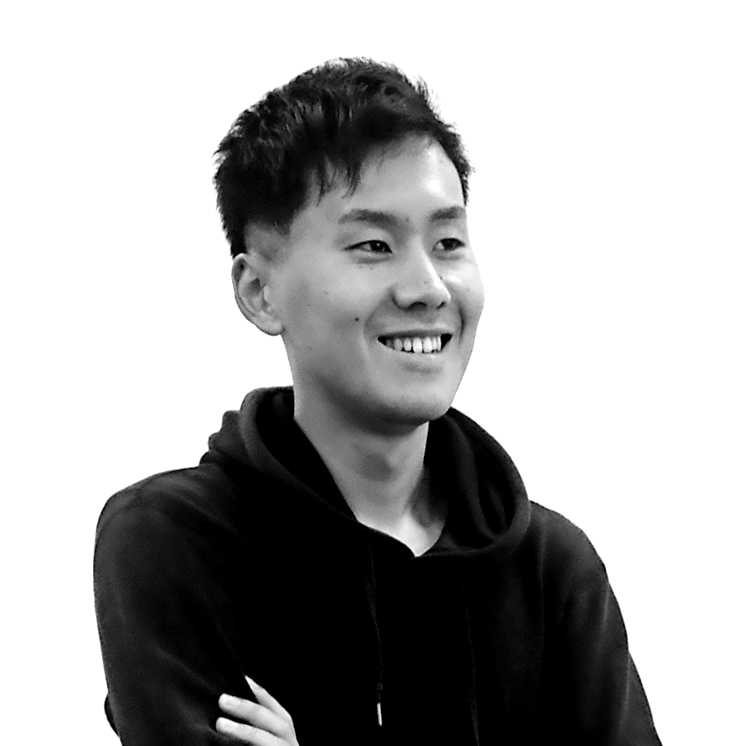

# Profile

# Products
## HashLab
This app can prove you your own performance without relying on a specific third party by providing apostille and distributed data storage.

https://hashlab-144c9.firebaseapp.com/

## Clowd Insurance

This app is an insurance service using a distributed voting system.
Participant voting will determine if the smart contract will apply insurance to the insured.

https://clowd-insurance.firebaseapp.com/

# Community
## blockchain.nagoya

I regularly host blockchain study sessions in Nagoya.

https://ether-nagoya.connpass.com/

## ブロックチェーンアプリ開発短期集中講座(Dapps development course)

I hold the Ethereum application development course in Nagoya.

https://docs.google.com/presentation/d/1lHr7c4MSblhqLWWdpHYYILlVn5CcN-QmG4JCak1mYYA/edit?usp=sharing

# Job
## Acompany Co., Ltd.

I work in the Acompany's R&D team.

https://acompany.tech/